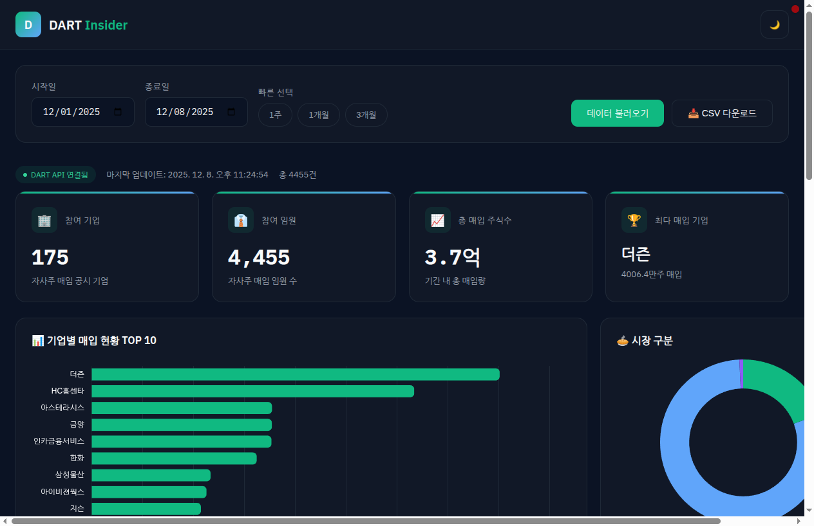

# DART Insider

DART 임원 자사주 매입 현황 조회 웹 서비스



## Features

- 날짜 범위별 임원 자사주 매입 현황 조회
- 기업별 매입 현황 TOP 10 차트
- 코스피/코스닥 시장 구분 차트
- 검색 및 정렬 가능한 데이터 테이블
- CSV 다운로드
- 다크/라이트 모드

## Tech Stack

- **Frontend**: Vanilla JS, Chart.js
- **Backend**: FastAPI, httpx
- **Data Source**: [DART OpenAPI](https://opendart.fss.or.kr)

## Local Development

```bash
pip install -r requirements.txt
python server.py
# Open http://localhost:8080
```

## Deployment

Vercel에 배포됨: [dart-insider.vercel.app](https://dart-insider.vercel.app)

## License

MIT
